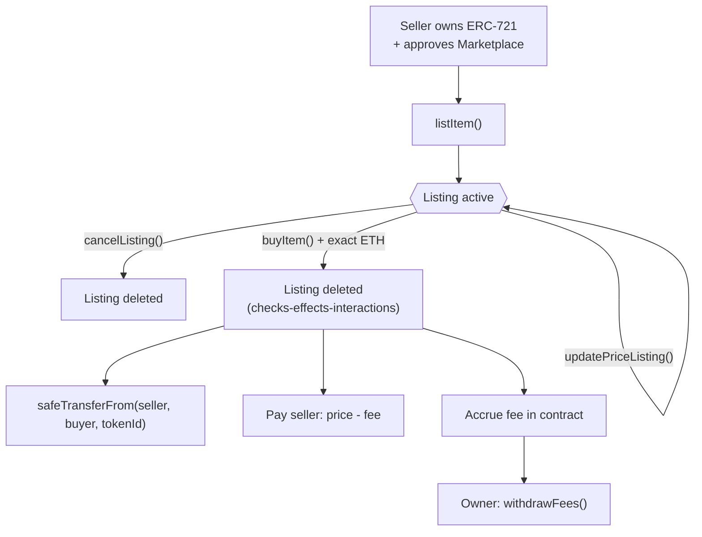

# NFT Marketplace

A minimal, gas-conscious marketplace smart contract that lets any ERC-721 holder list a token for sale and any buyer purchase it in exchange for native currency (ETH). Ownership transfers happen atomically at the moment of purchase — no escrow, no custody risk for the seller while the item is listed.

Built with [Foundry](https://book.getfoundry.sh/) and [OpenZeppelin Contracts](https://www.openzeppelin.com/contracts) (`Ownable`, `ReentrancyGuard`), with full unit test coverage and CI enforced via GitHub Actions on every push.

## How it works

The protocol is implemented in a single core contract:

1. [`NFTMarketplace`](https://github.com/davidvp-dev/nft-marketplace/blob/main/src/NFTMarketplace.sol): manages listings, purchases, price updates, cancellations and marketplace fee collection. NFTs are **not** held in escrow — sellers keep custody of the token and simply `approve` the marketplace to transfer it once a buyer pays the asking price.



Every purchase follows the checks-effects-interactions pattern: the listing is deleted and the fee is accounted for *before* the NFT transfer and ETH payout are executed, and `buyItem` is additionally protected by OpenZeppelin's `nonReentrant` modifier — so a malicious NFT contract or a seller with a reverting `receive()` can't re-enter the flow or lock a sale in an inconsistent state.

## Technical docs

1. **List an NFT for sale** — the caller must own the token and have approved the marketplace to transfer it. [Check function](https://github.com/davidvp-dev/nft-marketplace/blob/main/src/NFTMarketplace.sol#L54-L67)

```solidity
/**
 * @notice Lists an ERC-721 token for sale.
 * @dev The caller must own the token and approve this contract to transfer it.
 * @param nftAddress_ The address of the ERC-721 contract.
 * @param tokenId_ The ID of the NFT to list.
 * @param price_ The sale price in the native currency, denominated in wei.
 */
function listItem(address nftAddress_, uint256 tokenId_, uint256 price_) external;
```

2. **Buy a listed NFT** — pays the exact listed price, transfers the NFT to the buyer, and settles the marketplace fee. [Check function](https://github.com/davidvp-dev/nft-marketplace/blob/main/src/NFTMarketplace.sol#L76-L93)

```solidity
/**
 * @notice Purchases a listed NFT for the exact asking price.
 * @dev The listing is deleted before external calls are made. Reentrancy protection
 * prevents a malicious NFT contract or seller from re-entering this function.
 * @param nftAddress_ The address of the ERC-721 contract.
 * @param tokenId_ The ID of the listed NFT.
 */
function buyItem(address nftAddress_, uint256 tokenId_) external payable;
```

3. **Update or cancel a listing** — only the original seller can change the price or pull the listing. [Check functions](https://github.com/davidvp-dev/nft-marketplace/blob/main/src/NFTMarketplace.sol#L101-L119)

```solidity
function updatePriceListing(address nftAddress_, uint256 tokenId_, uint256 price_) external;
function cancelListing(address nftAddress_, uint256 tokenId_) external;
```

4. **Admin functions** — restricted to the contract owner via OpenZeppelin's `Ownable`. [Check functions](https://github.com/davidvp-dev/nft-marketplace/blob/main/src/NFTMarketplace.sol#L121-L135)

```solidity
function updateMarketplaceFee(uint256 newFee_) external onlyOwner; // fee expressed in basis points (10000 = 100%)
function withdrawFees() external onlyOwner;
```

## Execution example

> Pending deployment — this section will be completed once the contracts are live on a testnet/mainnet.

- Network: `<NETWORK>`
- Marketplace address: `<CONTRACT_ADDRESS>`

Execution steps:

1. Seller approves the marketplace to manage the NFT: `<TX_HASH>`
2. Seller lists the NFT by calling `listItem`: `<TX_HASH>`
3. Buyer purchases the NFT by calling `buyItem` with the exact price: `<TX_HASH>`
4. Owner withdraws the accumulated marketplace fees: `<TX_HASH>`

## Testing

All functions are covered by the Foundry test suite in [`test/NFTMarketplaceTest.t.sol`](https://github.com/davidvp-dev/nft-marketplace/blob/main/test/NFTMarketplaceTest.t.sol), covering the full happy path as well as edge cases (unauthorized callers, incorrect payment amounts, unlisted items, and sellers whose `receive()` reverts).

To run the tests:

```shell
forge test
```

To check coverage:

```shell
forge coverage
```

The suite passes 25/25 tests with full coverage across the board:

| File | % Lines | % Statements | % Branches | % Funcs |
|---|---|---|---|---|
| `src/NFTMarketplace.sol` | 100.00% (40/40) | 100.00% (39/39) | 100.00% (22/22) | 100.00% (7/7) |
| `test/NFTMarketplaceTest.t.sol` | 100.00% (5/5) | 100.00% (2/2) | N/A (0/0) | 100.00% (3/3) |
| **Total** | **100.00% (45/45)** | **100.00% (41/41)** | **100.00% (22/22)** | **100.00% (10/10)** |

## Contract addresses

> To be completed once deployed.

| Contract | Network | Address | Explorer |
|---|---|---|---|
| `NFTMarketplace.sol` | `<NETWORK>` | `<ADDRESS>` | `<EXPLORER_LINK>` |

## License

MIT — see the SPDX identifier in the contract source.